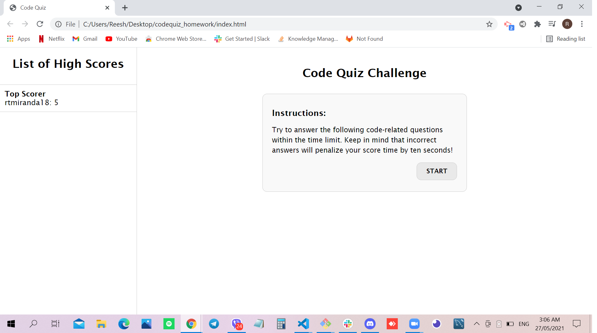

# WEB API QUIZ

## Site Picture


## Technologies Used
- HTML - creates elements on the DOM
- CSS - adds style to html elements
- Javascript - adds special effects on pages
- GitBash - for cloning repository and pushing code to GitHub
- GitHub - holds repository that deploys to GitHub Pages

## Summary
This file contains the webpage for a Code Quiz. It also contains code that was created using HTML, CSS and Javascript. 

## Code Snippet
```javascript
function submitInitialName() {
  var getInitialName = initialName.value;
  examiners.push({
    name: getInitialName, 
    score: myScore
  })
  console.log(examiners);
  listOfExaminers.innerHTML = 
        "<ul>" 
            + examiners.sort(function(a, b){return b.score - a.score}).map((examiner, index) => "<li class='examiner_"+index+"'>" + (index == 0 ? "<strong>Top Scorer</strong><br />" : "")+ examiner.name + ": "+ examiner.score +"</li>").join("") +
        "</ul>";
  initialName.value = '';
  resetExam();
  return false;
}
```

```javascript
<javascript>

</javascript>
```

## Author Links 
[LinkedIn](https://www.linkedin.com/in/rosario-miranda-b81170132/)<br />
[GitHub](https://github.com/rtmiranda18)
